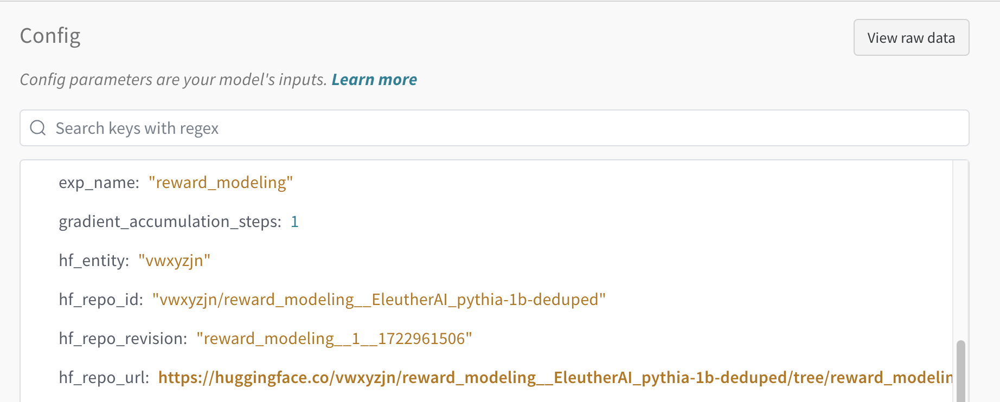
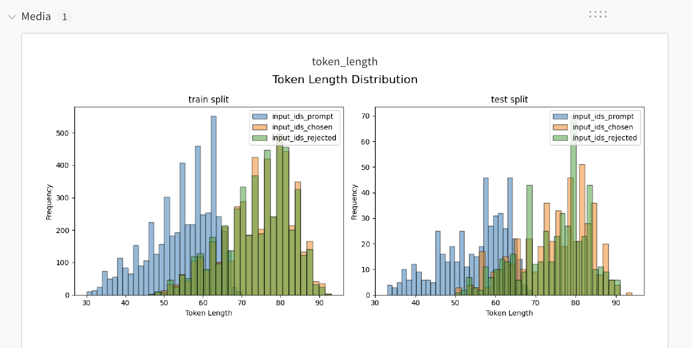
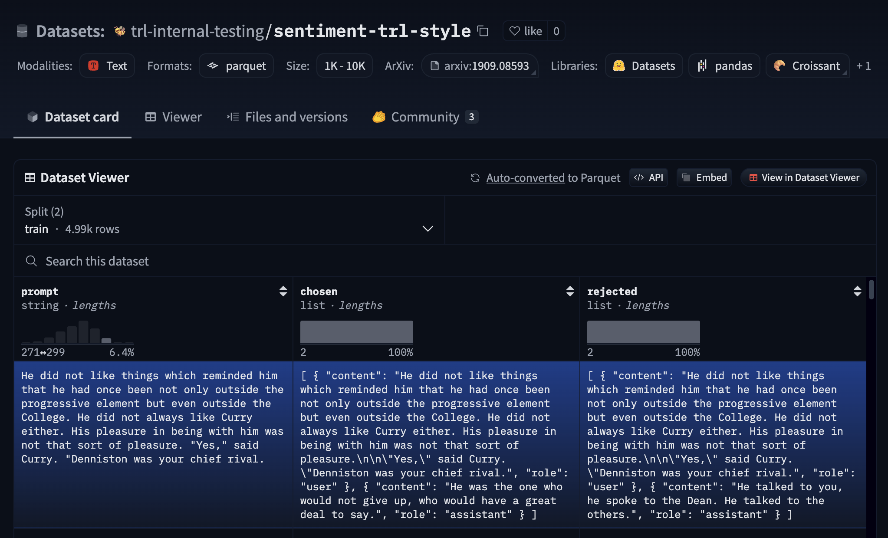
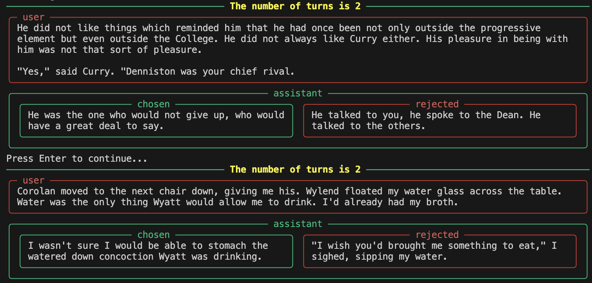
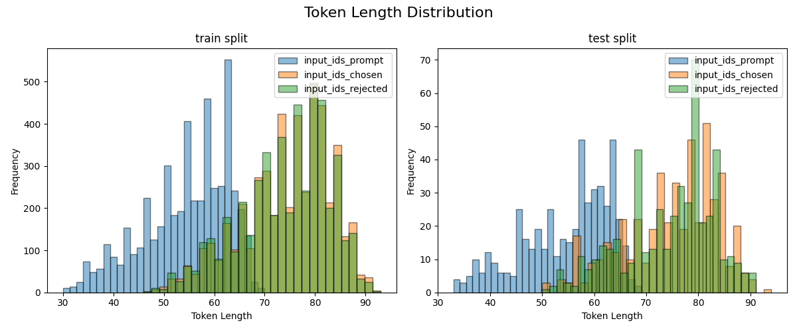

# Reward model training

`open_instruct/reward_modeling.py` contains the script for training reward models.


## Get started

Here is a command to train a simple reward model on the sentiment dataset taken from [https://arxiv.org/abs/1909.08593](https://arxiv.org/abs/1909.08593) using the `pythia-1b-deduped` model. The training should take 2-10 minutes on a single GPU.


```bash
python open_instruct/reward_modeling.py \
    --dataset_name trl-internal-testing/sentiment-trl-style \
    --dataset_train_split train \
    --dataset_eval_split test \
    --model_name_or_path EleutherAI/pythia-1b-deduped \
    --chat_template simple_concat_with_space \
    --learning_rate 3e-6 \
    --per_device_train_batch_size 32 \
    --per_device_eval_batch_size 32 \
    --gradient_accumulation_steps 1 \
    --max_token_length 1024 \
    --max_prompt_token_lenth 1024 \
    --num_train_epochs 1 \
    --output_dir models/rm/rm_sentiment_1b \
    --with_tracking \
    --push_to_hub \
```

You would typically get a track run like https://wandb.ai/ai2-llm/open-instruct/runs/ztgnw64l


### Quality of life tools


Note that when running with `--push_to_hub` and `--with_tracking`, the HF repo is automatically tracked to wandb, so we link the tracked run and the trained model.




Furthermore, we also track the dataset length visualization in wandb (see detail in [here](#dataset-processing))





Finally, we also include samples 


## To debug

To debug you can run the command with `--sanity_check`, this way it will only deal with 100 samples from the dataset and cut down dataset processing time.

```bash
python -i open_instruct/reward_modeling.py \
    --dataset_name trl-internal-testing/sentiment-trl-style \
    --dataset_train_split train \
    --dataset_eval_split test \
    --model_name_or_path EleutherAI/pythia-14m \
    --chat_template simple_concat_with_space \
    --learning_rate 3e-6 \
    --per_device_train_batch_size 1 \
    --per_device_eval_batch_size 1 \
    --gradient_accumulation_steps 32 \
    --max_token_length 1024 \
    --max_prompt_token_lenth 1024 \
    --num_train_epochs 1 \
    --output_dir models/rm/rm \
    --sanity_check \
    --push_to_hub
```


## How does it work?


The reward modeling process in this script roughly includes two main steps: 1) dataset preprocessing and tokenization and 2) model training / evaluation / model saving.

Below are the dataset documentation to help understand how data is processed and tokenized.


### Dataset specification


Here we assume the preference dataset is an HF dataset with two columns: `chosen` and `rejected`. Each item in the columns should use [Hugging Face's chat template](https://huggingface.co/docs/transformers/main/en/chat_templating). For example, a chosen message would have the following format taken from [Anthropic's HH dataset](https://huggingface.co/datasets/trl-internal-testing/hh-rlhf-helpful-base-trl-style):


```python
[
  {
    "content": "How do I teach kids to meditate?",
    "role": "user"
  },
  {
    "content": "Great question! That's a really useful skill to cultivate, it can bring peace, calm, and happiness. I'm glad you want to teach your kids about it.",
    "role": "assistant"
  },
  {
    "content": "All right, so how do we start?",
    "role": "user"
  },
  {
    "content": "Well, we can get started with just being silent. You can tell the kids it's okay if they just sit there quietly for a few minutes without thinking of anything.",
    "role": "assistant"
  }
]
```

Note that the message also don't have look like conversations or multi-turn. The dataset may use it for just any prompt and response pairs. For example, [trl-internal-testing/sentiment-trl-style](https://huggingface.co/datasets/trl-internal-testing/sentiment-trl-style) is about making the completion of a prompt sound more positive.

```python
[
  {
    "content": "He did not like things which reminded him that he had once been not only outside the progressive element but even outside the College. He did not always like Curry either. His pleasure in being with him was not that sort of pleasure.\n\n\"Yes,\" said Curry. \"Denniston was your chief rival.",
    "role": "user"
  },
  {
    "content": "He was the one who would not give up, who would have a great deal to say.",
    "role": "assistant"
  }
]
```


Here are some more examples:

* [trl-internal-testing/sentiment-trl-style](https://huggingface.co/datasets/trl-internal-testing/sentiment-trl-style)
* [trl-internal-testing/descriptiveness-trl-style](https://huggingface.co/datasets/trl-internal-testing/descriptiveness-trl-style)
* [trl-internal-testing/tldr-preference-trl-style](https://huggingface.co/datasets/trl-internal-testing/tldr-preference-trl-style)
* [trl-internal-testing/hh-rlhf-trl-style](https://huggingface.co/datasets/trl-internal-testing/hh-rlhf-trl-style)
* [HuggingFaceH4/ultrafeedback_binarized](https://huggingface.co/datasets/HuggingFaceH4/ultrafeedback_binarized)


The dataset on HF roughly looks like the following:




(Temporary) You can interact with these datasets as well. Currently the best way to visualize the dataset is through `costa_utils`

```bash
pip install costa_utils
python -m costa_utils.hf_viz \
    --preference trl-internal-testing/sentiment-trl-style \
    --split train_prefs \
    --preference_chosen_column_name chosen \
    --preference_rejected_column_name rejected
```



### Dataset tokenization

Ultimately, the reward modeling takes tokenized data as inputs, so we need to tokenize these texts. We do so via HF's chat_template. Here is a basic snippet on how they works. You can use different templates to add a new space, a new line, or "User:" and "Assistant" identification before the actual message contents.


```python
from transformers import AutoTokenizer
from open_instruct.dataset_processor import CHAT_TEMPLATES
chat = [
  {
    "content": "This is really an amazing thing.",
    "role": "user"
  },
  {
    "content": "I am glad you said that.",
    "role": "assistant"
  }
]
tokenizer = AutoTokenizer.from_pretrained("gpt2")
tokenizer.chat_template = CHAT_TEMPLATES["simple_concat_with_space"]
print(repr(tokenizer.chat_template))
# "{{' ' if not loop.first else ''}}{{message['content']}}{{eos_token}}"
print(tokenizer.apply_chat_template(chat, tokenize=False))
# This is really an amazing thing. I am glad you said that.<|endoftext|>

tokenizer.chat_template = CHAT_TEMPLATES["simple_chat"]
print(repr(tokenizer.chat_template))
# "{{'\n\n' if not loop.first else ''}}{{message['role']|capitalize + ': ' +message['content']}}{{eos_token}}"
print(tokenizer.apply_chat_template(chat, tokenize=False))
# User: This is really an amazing thing.
#
# Assistant: I am glad you said that.<|endoftext|>
```

Those `tokenizer.apply_chat_template(chat, tokenize=False)` strings are going to get tokenized and will be ultimately used to train the reward model.


### Dataset processing


To make sure the tokenization process is as transparent as possible. We provide a `DatasetProcessor` class that can be used to tokenize the dataset and visualize the tokenization process. Here is an example of how to use it:

```python
from transformers import AutoTokenizer
from datasets import load_dataset
from trl.dataset_processor import (
    CHAT_TEMPLATES,
    INPUT_IDS_CHOSEN_KEY,
    DatasetConfig,
    PreferenceDatasetProcessor,
    visualize_token,
)
dataset_config = DatasetConfig(
    dataset_name="trl-internal-testing/sentiment-trl-style",
    chat_template="simple_chat",
    max_token_length=1024,
    max_prompt_token_lenth=1024,
)
tokenizer = AutoTokenizer.from_pretrained("gpt2")
tokenizer.chat_template = CHAT_TEMPLATES["simple_chat"]
dataset = load_dataset(dataset_config.dataset_name)
dataset_processor = PreferenceDatasetProcessor(tokenizer=tokenizer, config=dataset_config)
dataset_processor.sanity_check_(dataset)
dataset = dataset_processor.tokenize(dataset)
dataset = dataset_processor.filter(dataset)
dataset_processor.get_token_length_visualization(dataset, save_path="tmp.png")
train_dataset = dataset[dataset_config.dataset_train_split]
eval_dataset = dataset[dataset_config.dataset_eval_split]
visualize_token(train_dataset[0][INPUT_IDS_CHOSEN_KEY], tokenizer)
print(INPUT_IDS_CHOSEN_KEY) # input_ids_chosen
```

Here we produced the tokenized dataset, with columns 

-   `input_ids_chosen: List[int]`
-   `input_ids_rejected: List[int]`


The `visualize_token` will output the following colored tokens:


The `dataset_processor.get_token_length_visualization` will output the visualization on the token length for the `chosen`, `rejected` and `prompt` in `tmp.png`.




### Model training

Then given the tokenized datasets, we train on those using the logsigmoid loss. Namely `loss = -F.logsigmoid(chosen_rewards - rejected_rewards).mean()`. 


## Explanation of the logged metrics


* `episode`: the global episode number training has gone through (e.g., `3000` means we have trained on 3000 data points already)
* `epoch`: the fraction or multiple of the epoch (e.g., `2.7` means we have trained on the dataset for 2 epochs and 70% of the third epoch)
* `train/rm/accuracy`: the training accuracy of the training batch
* `train/rm/loss`: the logsigmoid loss of the reward modeling of the training batch
* `train/rm/chosen_reward`: the reward of the chosen responses of the training batch
* `train/rm/rejected_reward`: the reward of the rejected responses of the training batch
* `train/rm/reward_margin`: the reward margin (chosen_reward - rejected_reward) of the training batch
* `train/rm/lr`: the training learning rate


We also have `eval/rm/accuracy`, `eval/rm/loss`, `eval/rm/chosen_rewards`, `eval/rm/rejected_rewards`, `eval/rm/reward_margin` for the evalation dataset.


## Implementation details

These are relevant implementation details on reward modeling:

1. The tokenizer pads from the right: when the length of the data points differ, the tokenizer pads from the right
1. Disable dropout in the model: this is actually an implementation detail in PPO training, but for consistency we also disable dropout in the reward model training (see p.3. in https://arxiv.org/pdf/1909.08593)
1. Layer initialization: we initialize the score's weight according to `std=1 / np.sqrt(model.config.hidden_size + 1)` (see p. 11 in https://arxiv.org/abs/2009.01325)


## Experiment results


```bash
# LEVEL 1: single GPU model training; adjust your `per_device_train_batch_size` and
# `gradient_accumulation_steps` accordingly
# you can also use the `trl-internal-testing/descriptiveness-trl-style` dataset
python open_instruct/reward_modeling.py \
    --dataset_name trl-internal-testing/sentiment-trl-style \
    --dataset_train_split train \
    --dataset_eval_split test \
    --model_name_or_path EleutherAI/pythia-1b-deduped \
    --chat_template simple_concat_with_space \
    --learning_rate 3e-6 \
    --per_device_train_batch_size 32 \
    --per_device_eval_batch_size 32 \
    --gradient_accumulation_steps 1 \
    --max_token_length 1024 \
    --max_prompt_token_lenth 1024 \
    --num_train_epochs 1 \
    --output_dir models/rm/rm_sentiment_1b \
    --with_tracking \
    --push_to_hub \
```

Tracked experiment: https://wandb.ai/ai2-llm/open-instruct/runs/ztgnw64l
Trained model: https://huggingface.co/vwxyzjn/reward_modeling__EleutherAI_pythia-1b-deduped/tree/reward_modeling__1__1722961506


```bash
# LEVEL 2: multi-gpu training using DS2 with the TL;DR summarization dataset
accelerate launch  --config_file configs/ds_configs/deepspeed_zero2.yaml \
    open_instruct/reward_modeling.py \
    --dataset_name trl-internal-testing/tldr-preference-trl-style \
    --dataset_train_split train \
    --dataset_eval_split validation \
    --model_name_or_path EleutherAI/pythia-1b-deduped \
    --chat_template simple_concat_with_space \
    --learning_rate 3e-6 \
    --per_device_train_batch_size 32 \
    --per_device_eval_batch_size 32 \
    --gradient_accumulation_steps 1 \
    --max_token_length 1024 \
    --max_prompt_token_lenth 512 \
    --num_train_epochs 1 \
    --output_dir models/rm/rm_tldr_1b \
    --with_tracking \
    --push_to_hub
```

Tracked experiment: https://wandb.ai/ai2-llm/open-instruct/runs/etfpvan2
Trained model: https://huggingface.co/vwxyzjn/reward_modeling__EleutherAI_pythia-1b-deduped/tree/reward_modeling__1__1722961863

```bash
# LEVEL 2: multi-gpu training using DS2 with the anthropic HH dataset
accelerate launch --config_file configs/ds_configs/deepspeed_zero2.yaml \
    open_instruct/reward_modeling.py \
    --dataset_name trl-internal-testing/hh-rlhf-trl-style \
    --dataset_train_split train \
    --dataset_eval_split test \
    --model_name_or_path EleutherAI/pythia-1b-deduped \
    --chat_template simple_chat \
    --learning_rate 3e-6 \
    --per_device_train_batch_size 8 \
    --per_device_eval_batch_size 8 \
    --gradient_accumulation_steps 4 \
    --max_token_length 2048 \
    --max_prompt_token_lenth 1024 \
    --num_train_epochs 1 \
    --output_dir models/rm/rm_hh_1b \
    --with_tracking \
    --push_to_hub 
```

Tracked experiment: https://wandb.ai/ai2-llm/open-instruct/runs/0uwj4pmt
Trained model: https://huggingface.co/vwxyzjn/reward_modeling__EleutherAI_pythia-1b-deduped/tree/reward_modeling__1__1722962876


```bash
# TODO (Costa): to be tested
# LEVEL 3: multi-gpu training using DS2 with the ultrafeedback dataset
accelerate launch --config_file examples/accelerate_configs/deepspeed_zero2.yaml \
    open_instruct/rm_zephyr.py \
    --dataset_name HuggingFaceH4/ultrafeedback_binarized \
    --dataset_train_split train_prefs \
    --dataset_eval_split test_prefs \
    --chat_template zephyr \
    --learning_rate 3e-6 \
    --per_device_train_batch_size 1 \
    --per_device_eval_batch_size 1 \
    --gradient_accumulation_steps 32 \
    --max_token_length 1024 \
    --max_prompt_token_lenth 1024 \
    --num_train_epochs 1 \
    --bf16 \
    --output_dir models/rm/rm_zephyr_7b \
```