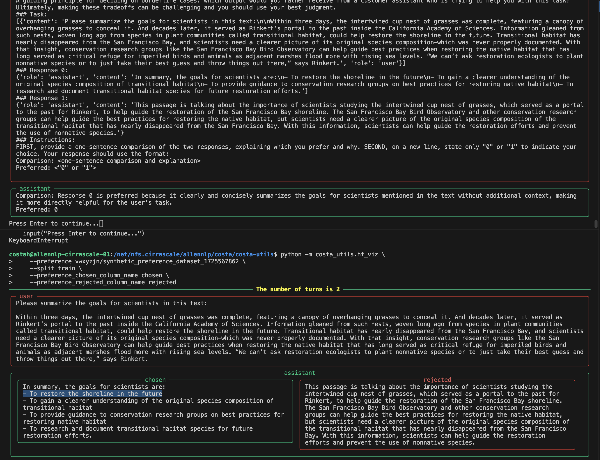

# Synthetic preference dataset


# Debug run (use an interactive session)

This code supports HF models, local models and also API-based models (e.g., `gpt-4`). For generating completions, the code now accepts one model at a time, but we're working on adding an ensemble of models. Stay tuned. 

```bash
# 1. first sample a bunch of completions given prompts
# Here is an example created dataset: https://huggingface.co/datasets/vwxyzjn/generation_1725567768
python open_instruct/rejection_sampling/generation.py \
    --dataset_name HuggingFaceH4/no_robots \
    --model_name_or_path allenai/llama-3-tulu-2-8b \
    --num_completions 3 \
    --save_filename output/completions.jsonl \
    --sanity_check \
    --push_to_hub
```

### Create preference pairs

```bash
# 2.1 do LLM as a judge to create synthetic preference dataset
# Here is an example created dataset: https://huggingface.co/datasets/vwxyzjn/synthetic_preference_dataset_1725567862
python open_instruct/rejection_sampling/synthetic_preference_dataset.py \
    --input_filename output/completions.jsonl \
    --model gpt-4o-2024-08-06 \
    --save_filename output/synthetic_preferences.jsonl \
    --num_completions 3 \
    --push_to_hub \
```


You can visualize the dataset via 

```bash
python -m costa_utils.hf_viz \
    --sft vwxyzjn/synthetic_preference_dataset_1725567862 \
    --split train \
    --sft_messages_column_name whole_conversation

python -m costa_utils.hf_viz \
    --preference vwxyzjn/synthetic_preference_dataset_1725567862 \
    --split train \
    --preference_chosen_column_name chosen \
    --preference_rejected_column_name rejected
```

